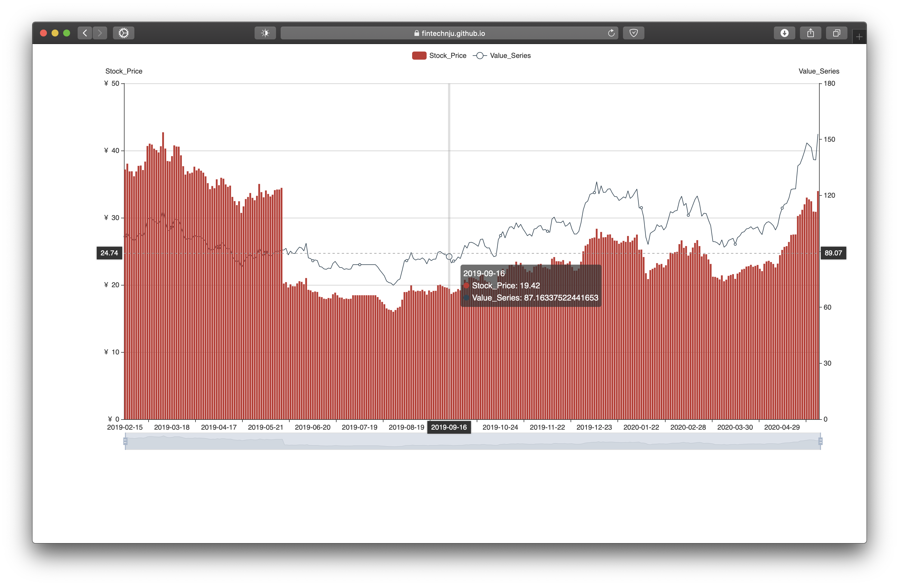
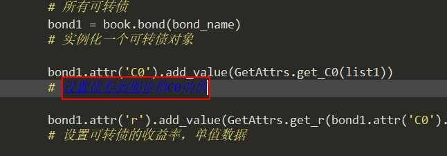
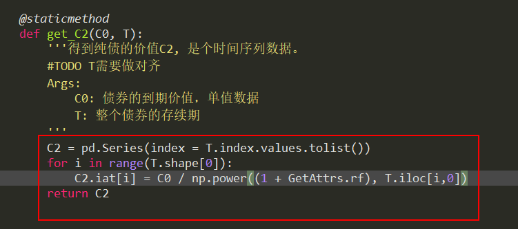

# Convertible_Bond.py
## 计算可转债的纯债价值，期权价值。

|                           函数结构                           |  注释  |
| :----------------------------------------------------------: | :----: |
| [Convertible_Bond](https://github.com/FinTechNJU/Bond/blob/master/Convertible_Bond.py) | 主程序 |
| [Container](https://github.com/FinTechNJU/Bond/blob/master/Container.py) |  容器  |
| [Adapter](https://github.com/FinTechNJU/Bond/blob/master/Adapter.py) | 适配器 |
| [Function](https://github.com/FinTechNJU/Bond/blob/master/Function.py) |  函数  |

------

|                      5.27日完成的任务                       |
| :---------------------------------------------------------: |
| p1 和 p2 都是计算可转债的期权价值和PV的。实现的效果是一样的 |
|  **book.bond(bond_name).attribute(C1).value() 是期权价值**  |
|    **book.bond(bond_name).attribute(C2).value() 是PV**     |

|                     链接表格                      |
| :---------------------------------------------------------: |
|[可转债套利空间的示例](https://github.com/FinTechNJU/ConvertibleBond/blob/master/output/128054.SZ.csv)|
|[打开图片有问题？ 点击获取我分享的免费VPN，适用于windows、macos和linux](https://github.com/FinTechNJU/Tutorial/issues/2)|
|[Python交互图链接地址](https://fintechnju.github.io/Bond/output/StockPrice_ValueSeries.html) |

--------------
## TODO

|                 5月29日 事情列表                  |
| :-----------------------------------------------: |
|                   ~~把rf改掉~~                    |
|        改第一个图当中跳跃的点 用Excel画图         |
|          把第一张图当中的上面的图拉下来           |
|              可转债价格y和股价x的图               |
|          我们设置90%转股价格点为 分界点           |
|        分界点前pv+期权 分界点后是股价+期权        |
| ~~行权价K我们选取不变的，后期再在时间序列上操作~~ |

|            5月30日 事情列表            |
| :------------------------------------: |
|       价外期权 价内期权 都试一下       |
|        多选几个ETF的期权试一下         |
|      要用510050.SH的作为标的资产       |
| 50ETF购四月2.65 四月份到期，行权价2.65 |

------

## Wiki

* 价内期权是具有内在价值的期权。期权持有人行权时，对[看涨期权](https://www.baidu.com/s?wd=看涨期权&tn=SE_PcZhidaonwhc_ngpagmjz&rsv_dl=gh_pc_zhidao)而言，行权价格低于标的证券结算价格；对看跌期权而言，标的证券结算价格低于行权价格。

* 价外期权一般指虚值期权，是指不具有内涵价值的期权，即敲定价高于当时[期货价格](https://www.baidu.com/s?wd=期货价格&tn=SE_PcZhidaonwhc_ngpagmjz&rsv_dl=gh_pc_zhidao)的[看涨期权](https://www.baidu.com/s?wd=看涨期权&tn=SE_PcZhidaonwhc_ngpagmjz&rsv_dl=gh_pc_zhidao)或敲定价低于当时[期货价格](https://www.baidu.com/s?wd=期货价格&tn=SE_PcZhidaonwhc_ngpagmjz&rsv_dl=gh_pc_zhidao)的看跌期权。如果把企业的[股权资本](https://www.baidu.com/s?wd=股权资本&tn=SE_PcZhidaonwhc_ngpagmjz&rsv_dl=gh_pc_zhidao)看作是一种买方期权，则标的资产即是企业的总资产，而企业的负债值可看作是期权合约上的约定价。期权的有效期即与负债的期限相同。

--------
## Figures

* 正股股(Stock_Price)转股价值(Value_Series)折线图 

------

## 问题列表

以下数据可以自动获得或者可以爬取吗？

* 我是这么计算终值的
* 现在我想得到在债券发行期内，指定时间点(某一天)的 纯债价值

* 纯债的价值C2
* 纯债的价值是递增的？？
* 是的。因为两个到期价值一样的债券，更快到期的，获利能力更强，应该价值越大。

